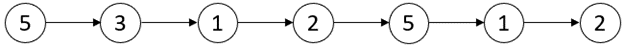
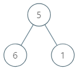

### Problem_list
>In this markdown file, the author (Xiyue) has recorded his favorite algorithm problems, which are also relatively challenging, and thus worth revisiting and studying repeatedly.

>The Problems are sorted based on the topics

##### Two Pointers
1. *2831: Find the Longest Equal Subarray*
- You are given a 0-indexed integer array nums and an integer k. A subarray is called equal if all of its elements are equal. Note that the empty subarray is an equal subarray. Return the length of the longest possible equal subarray after deleting at most k elements from nums.

Example: 
`Input: nums = [1,3,2,3,1,3], k = 3`
`Output: 3`
Explanation: It's optimal to delete the elements at index `2` and index `4`.
After deleting them, nums becomes equal to `[1, 3, 3, 3]`.
The longest equal subarray starts at `i = 1` and ends at `j = 3` with length equal to `3`. 
It can be proven that no longer equal subarrays can be created.

> Notice the element is not replaced, so the standard `right - left + 1` cannot be applied here. Rather, you can travser the `dict` to see if satisfy the `k` factor.

```python
def longestEqualSubarray(nums: List[int], k: int) -> int:
        count = defaultdict(list)
        for i, num in enumerate(nums):
            count[num].append(i)
        res = 0
        for tmp in count.values():
            left = 0
            for right in range(len(tmp)):
                while tmp[right] - tmp[left] + 1 - (right - left + 1) > k:
                    left += 1
                res = max(res, right - left + 1)
        return res
```
2. *2875: Minimum Size Subarray in Infinite Array*
- You are given a 0-indexed array `nums` and an integer `target`. A 0-indexed array `infinite_nums` is generated by infinitely appending the elements of nums to itself.
Return the length of the shortest subarray of the array `infinite_nums` with a sum equal to target. If there is no such subarray return `-1`.
`1 <= nums[i] <= 105`
`1 <= target <= 109`

Example: 
`Input: nums = [1,1,1,2,3], target = 4`
`Output: 2`
Explanation: In this example `infinite_nums = [1,1,1,2,3,1,1,1,2,3,1,1,...]`.
The subarray in the range `[4,5]`, has the sum equal to `target = 4` and `length = 2`.
It can be proven that 2 is the shortest length of a subarray with sum equal to `target = 4`.
>When it comes to a infinity loop, think of Mod, notice all `num` in `nums` are positive, we can use sliding window

```python
def minSizeSubarray(nums: List[int], target: int) -> int:
    k, mod = divmod(target, sum(nums))
    if mod == 0:
        return k * len(nums)
    left, ans, tmp = 0, float('inf'), 0
    arr = nums * 2
    for i, num in enumerate(arr):
        tmp += num
        while tmp > mod:
            tmp -= arr[left]
            left += 1
        if tmp == mod:
            ans = min(ans, i - left + 1)
    return k * len(nums) + ans if ans != float('inf') else -1
```
3. *3643: Flip Square Submatrix Vertically*
- You are given an m x n integer matrix grid, and three integers x, y, and k. 
The integers x and y represent the row and column indices of the top-left corner of a square submatrix and the integer k represents the size (side length) of the square submatrix.
Your task is to flip the submatrix by reversing the order of its rows vertically. Return the updated matrix.

Example1:
`Input: grid = [[1,2,3,4],[5,6,7,8],[9,10,11,12],[13,14,15,16]], x = 1, y = 0, k = 3`
`Output: [[1,2,3,4],[13,14,15,8],[9,10,11,12],[5,6,7,16]]`

<p align="center">

</p>

> Two Pointers again, but vertically
```python
def reverseSubmatrix(grid: List[List[int]], x: int, y: int, k: int) -> List[List[int]]:
    l, r = x, x + k - 1
    while l < r:
        for i in range(y, y + k):
            grid[l][i], grid[r][i] = grid[r][i], grid[l][i]
        r -= 1
        l += 1
    return grid
```
4. *498: Diagonal Traverse*
<p align="center">

</p>

`Input: mat = [[1,2,3],[4,5,6],[7,8,9]]`
`Output: [1,2,4,7,5,3,6,8,9]`
>use dict store all the `(i + j)` pairs
```python
def findDiagonalOrder(matrix: List[List[int]]) -> List[int]:
        count = defaultdict(list)
        for i in range(len(matrix)):
            for j in range(len(matrix[0])):
                count[i + j].append(matrix[i][j])
        res = []
        for key, lst in count.items():
            if key % 2 == 0:
                res += list(reversed(lst))
            else:
                res += lst
        return res   
```
5. *Rotate Array*
- Given an integer array nums, rotate the array to the right by k steps, where k is non-negative.
`Input: nums = [1,2,3,4,5,6,7], k = 3`
`Output: [5,6,7,1,2,3,4]`
Explanation:
rotate 1 steps to the right: `[7,1,2,3,4,5,6]`
rotate 2 steps to the right: `[6,7,1,2,3,4,5]`
rotate 3 steps to the right: `[5,6,7,1,2,3,4]`
> Tackle in O(n) efficiency, only traverse 3 times
```python
def rotate(nums: List[int], k: int) -> None:
        """
        Do not return anything, modify nums in-place instead.
        """
        def f(start, end, nums):
            while start < end:
                nums[start], nums[end] = nums[end], nums[start]
                end -= 1
                start += 1
        
        k %= len(nums)
        f(0, len(nums) - 1, nums)
        f(0, k - 1, nums)
        f(k, len(nums) - 1, nums)
```
6. *Trapping Rain Water*

Example: 
`Input: height = [0,1,0,2,1,0,1,3,2,1,2,1]`
`Output: 6`
Explanation: The above elevation map (black section) is represented by array `[0,1,0,2,1,0,1,3,2,1,2,1]`. In this case, 6 units of rain water (blue section) are being trapped.
<p align="center">

</p>
> Prefix and suffix

```python
def trap(height: List[int]) -> int:
        pre = [0] * len(height)
        pre_max = 0
        for i, num in enumerate(height):
            pre_max = max(pre_max, num)
            pre[i] = pre_max

        suf = [0] * len(height)
        suf_max = 0
        for i in range(len(height) - 1, -1, -1):
            suf_max = max(suf_max, height[i])
            suf[i] = suf_max

        res = 0
        for h, p, s in zip(height, pre, suf):
            res += min(s, p) - h
        return res
```

##### Binary Search 
1. *34: Find First and Last Position of Element in Sorted Array*
- Given an array of integers nums sorted in non-decreasing order, find the starting and ending position of a given target value.
- If target is not found in the array, return `[-1, -1]`.

> Binary Search then expand, good question not hard, can be used as starter

Example: 
`Input: nums = [5,7,7,8,8,10], target = 8`
`Output: [3,4]`
Example 2:
`Input: nums = [5,7,7,8,8,10], target = 6`
`Output: [-1,-1]`
```python
def searchRange(nums: List[int], target: int) -> List[int]:
        left, right = 0, len(nums) - 1
        l, r = -1, -1
        while left <= right:
            mid = (left + right) // 2
            if nums[mid] == target:
                l, r = mid, mid
                while r < len(nums) - 1 and nums[r + 1] == target:
                    r += 1
                while l > 0 and nums[l - 1] == target:
                    l -= 1
                break
            elif nums[mid] < target:
                left = mid + 1
            else:
                right = mid - 1
        return [l, r]
```
> with `bisect`
```python
def searchRange(nums: List[int], target: int) -> List[int]:
    if not nums:
        return [-1, -1]

    left = bisect.bisect_left(nums, target)
    right = bisect.bisect_right(nums, target) - 1

    if left < len(nums) and right >= 0 and nums[left] == target and nums[right] == target:
        return [left, right]
    else:
        return [-1, -1]
```
2. *1011: Capacity To Ship Packages Within D Days*
- A conveyor belt has packages that must be shipped from one port to another within days days.

- The ith package on the conveyor belt has a weight of weights`[i]`. Each day, we load the ship with packages on the conveyor belt (in the order given by weights). We may not load more weight than the maximum weight capacity of the ship.

- Return the least weight capacity of the ship that will result in all the packages on the conveyor belt being shipped within days days.

Example: 

`Input: weights = [1,2,3,4,5,6,7,8,9,10], days = 5`
`Output: 15`
Explanation: A ship capacity of 15 is the minimum to ship all the packages in 5 days like this:
1st day: 1, 2, 3, 4, 5
    2nd day: 6, 7
        3rd day: 8
            4th day: 9
                5th day: 10
> Binary Search + Prefix Sum

```python
 def shipWithinDays(weights: List[int], days: int) -> int:
        left, right = max(weights) - 1, sum(weights)

        while left + 1 < right:
            mid = (left + right) // 2
            count = 0
            current = 0

            for i in range(len(weights)):
                if current + weights[i] > mid:
                    count += 1
                    current = 0
                current += weights[i]
            count += 1

            if count > days:
                left = mid
            else:
                right = mid

        return right
```
##### Bit-manipulation
1. *Sort Integers by The Number of 1 Bits*
- You are given an integer array arr. Sort the integers in the array in ascending order by the number of 1's in their binary representation and in case of two or more integers have the same number of 1's you have to sort them in ascending order.

Return the array after sorting it.
Example: 
`Input: arr = [1024,512,256,128,64,32,16,8,4,2,1]`
`Output: [1,2,4,8,16,32,64,128,256,512,1024]`
Explantion: All integers have 1 bit in the binary representation, you should just sort them in ascending order.
> In this question, we will walk through two key points: python-sort and bitwise operators: this might not be optimal way, but can learn a lot 
```python
from functools import cmp_to_key
class Solution: 
    def sort(self, a: int, b: int):
        tmp_a, tmp_b = a, b
        # make sure the original number will not be affected
        count_a, count_b = 0, 0
        while tmp_a or tmp_b:
            if tmp_a:
                tmp_a &= (tmp_a - 1)
                count_a += 1
            if tmp_b:
                tmp_b &= (tmp_b - 1)
                count_b += 1
        
        # in cmp_to_key, a python sorting package tool
        # input: (a, b)
        # if return > 0 then python sorts it a > b
        # if return < 0 then python sorts it a < b
        # if return == 0 then python preserves its relative order

        if count_a != count_b:
            return count_a - count_b
        else:
            return a - b
        
    def sort_bit(self, arr: list) -> list:
        arr.sort(key = cmp_to_key(self.sort))
        return arr
```

##### Stack
1. *503: Next Greater Element II*
- Given a circular integer array nums (i.e., the next element of `nums[nums.length - 1]` is `nums[0]`), return the next greater number for every element in `nums`.

- The next greater number of a number `x` is the first greater number to its traversing-order next in the array, which means you could search circularly to find its next greater number. If it doesn't exist, return -1 for this number.

Example: 
`Input: nums = [1,2,1]`
`Output: [2,-1,2]`
Explanation: The first 1's next greater number is 2; 
The number 2 can't find next greater number. 
The second 1's next greater number needs to search circularly, which is also 2.

> Monotonic stack + mod 
```python
def nextGreaterElements(nums: List[int]) -> List[int]:
    n = len(nums)
    ans = [-1] * n
    stack = []
    for i in range(2 * n):
        num = nums[i % n]
        while stack and num > nums[stack[-1]]:
            index = stack.pop()
            ans[index] = num
        if i < n:
            stack.append(i)
    return ans 
```
##### Linked List
1. *Find the Minimum and Maximum Number of Nodes Between Critical Points*

<p align="center">

</p>

`Input: head = [5,3,1,2,5,1,2]`
`Output: [1,3]`
Explanation: There are three critical points:
- `[5,3,1,2,5,1,2]`: The third node is a local minima because 1 is less than 3 and 2.
- `[5,3,1,2,5,1,2]`: The fifth node is a local maxima because 5 is greater than 2 and 1.
- `[5,3,1,2,5,1,2]`: The sixth node is a local minima because 1 is less than 5 and 2.
The minimum distance is between the fifth and the sixth node. minDistance = 6 - 5 = 1.
The maximum distance is between the third and the sixth node. maxDistance = 6 - 3 = 3.

> Manipulate index in Linked List

```python
 def nodesBetweenCriticalPoints(head: Optional[ListNode]) -> List[int]:
        prev, cur = head, head.next
        if cur.next:
            nxt = cur.next
        else:
            return [-1, -1]

        index = 1
        min_distance = float('inf')
        last_index, first_index = -1, -1

        while nxt:
            if (cur.val < nxt.val and cur.val < prev.val) or (cur.val > nxt.val and cur.val > prev.val):
                if first_index == -1:
                    first_index = index
                else:
                   min_distance = min(min_distance, index - last_index)
                last_index = index 
            index += 1
            prev, cur, nxt = cur, nxt, nxt.next
        if first_index == -1 or last_index == first_index:
            return [-1, -1]
        return [min_distance, last_index - first_index]
```
2. *Merge In Between Linked Lists*
- You are given two linked lists: list1 and list2 of sizes n and m respectively.
- Remove list1's nodes from the ath node to the bth node, and put list2 in their place.
- The blue edges and nodes in the following figure indicate the result:
<p align="center">

</p>

>the essence of linked list, each traverse variable can only used once

```python
def mergeInBetween(list1: ListNode, a: int, b: int, list2: ListNode) -> ListNode:
    before_a = list1

    for _ in range(a - 1):
        before_a = before_a.next
    after_b = before_a

    for _ in range(b - a + 2):
        after_b = after_b.next
    
    before_a.next = list2
    tail = list2
    while tail.next: # avoid making it None
        tail = tail.next
    tail.next = after_b
    return list1
```
3. *Insertion Sort List in Linked List*
<p align="center">

</p>

```python
def insertionSortList(head: Optional[ListNode]) -> Optional[ListNode]:
        dummy = ListNode(float('-inf'), next = head)
        sorted_tail = head
        cur = head.next 
        while cur:
            if cur.val >= sorted_tail.val:
                sorted_tail = sorted_tail.next
                cur = cur.next
            else:
                prev = dummy
                next_process = cur.next
                while prev.next and prev.next.val < cur.val:
                    prev = prev.next
                cur.next = prev.next
                prev.next = cur
                sorted_tail.next = next_process
                cur = next_process
        return dummy.next
```
3. *Reverse Nodes in K-group*
<p align="center">

</p>

> A detailed explaination 
<p align="center">

</p>

```python
class Solution:
    def reverseKGroup(self, head: Optional[ListNode], k: int) -> Optional[ListNode]:
        dummy = ListNode(next = head)
        pre, end = dummy, dummy
        while end.next: 
            for _ in range(k):
                end = end.next 
                if not end:
                    return dummy.next 
                    
            start = pre.next
            nxt = end.next
            end.next = None 

            new_head = self.reverse(start)
            pre.next = new_head
            start.next = nxt 

            pre = start
            end = pre
            
        return dummy.next 


    def reverse(self, head):
        prev, cur = None, head
        while cur:
            nxt = cur.next 
            cur.next = prev
            prev = cur
            cur = nxt 
        return prev
```
##### Tree
1. *Maximum Average Subtree*
<p align="center">

</p>

`Input: root = [5,6,1]`
`Output: 6.00000`
Explanation: 
- For the node with value = 5 we have an average of (5 + 6 + 1) / 3 = 4.
- For the node with value = 6 we have an average of 6 / 1 = 6.
- For the node with value = 1 we have an average of 1 / 1 = 1.
- So the answer is 6 which is the maximum.

```python
def maximumAverageSubtree(root: Optional[TreeNode]) -> float:
        self.res = 0
        def dfs(root):
            if not root:
                return 0, 0
            l_val, l_cnt = dfs(root.left)
            r_val, r_cnt = dfs(root.right)
            self.res = max(self.res, (l_val + r_val + root.val) / (l_cnt + r_cnt + 1))
            return l_val + r_val + root.val, l_cnt + r_cnt + 1

        root and dfs(root)
        return self.res
```