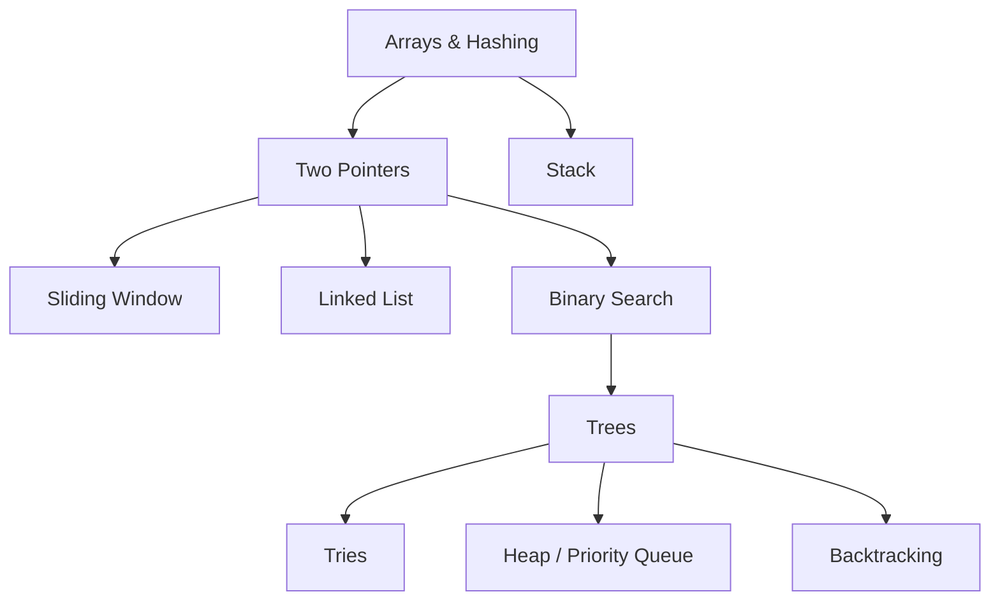

### My Algorithms Practice Repo
This repository is updated from time to time.

#### Algorithm Roadmap

```mermaid
graph TD
    A["Arrays & Hashing"]
    
    A --> B["Two Pointers"]
    A --> C["Stack"]

    B --> D["Sliding Window"]
    B --> E["Linked List"]
    B --> F["Binary Search"]

    F --> G["Trees"]

    G --> H["Tries"]
    G --> I["Heap / Priority Queue"]
    G --> J["Backtracking"]
```