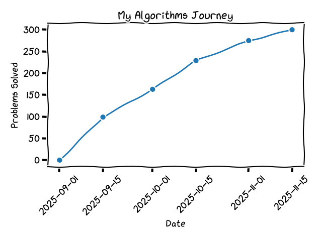
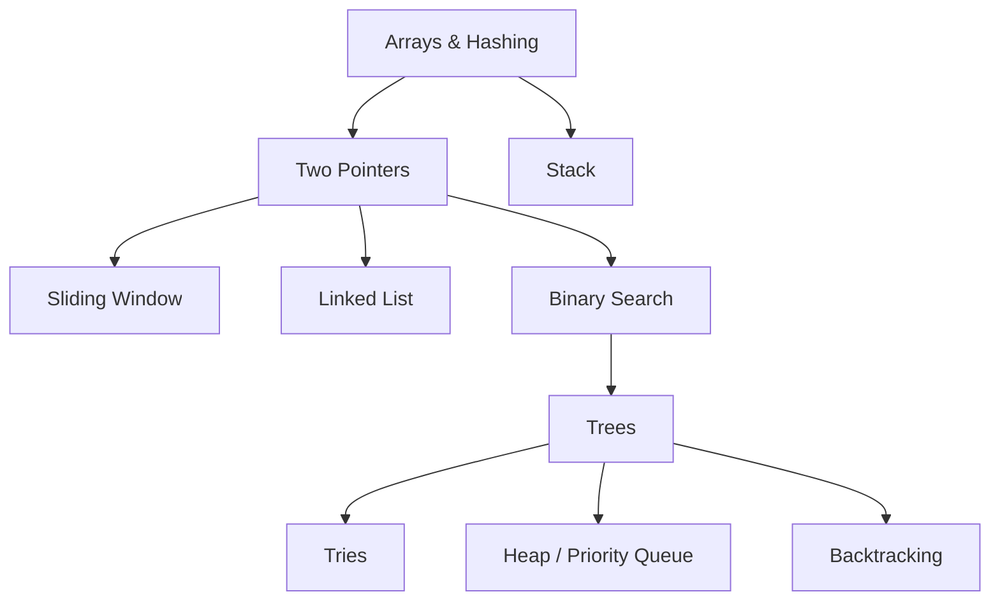

### My Algorithms Practice Repo
This repository documents my personal roadmap for practicing algorithm problems. It also includes my own curated list of favorite problems. Since I started learning data structures, I’ve developed a strong interest in algorithmic thinking — every problem feels like a new intellectual challenge!

#### Algorithm Roadmap

