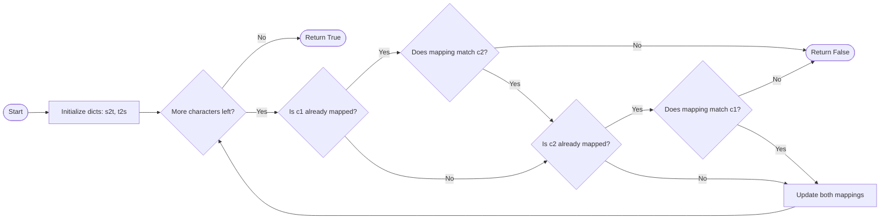

### 1. *Ismorphic strings*
Given two strings `s` and `t`, determine if they are isomorphic.
Two strings `s` and `t` are isomorphic if the characters in `s` can be replaced to get `t`.
All occurrences of a character must be replaced with another character while preserving the order of characters. No two characters may map to the same character, but a character may map to itself.
- Example 1:
`Input: s = "foo", t = "bar"`
`Output: false`
Explanation:
The strings s and t can not be made identical as 'o' needs to be mapped to both 'a' and 'r'.
- Example 2:
`Input: s = "paper", t = "title"`
`Output: true`

__Approach 1__
```python 
# establish a two-way mapping
def ismorphic(s: str, t: str) -> bool:
    s2t = {}
    t2s = {}
    for c1, c2 in zip(s, t):
        if c1 in s2t and s2t[c1] != c2:
            return False
        if c2 in t2s and t2s[c2] != c1:
            return False
        s2t[c1] = c2
        t2s[c2] = c1
    return True 
```

__Approach 2__
```python
# less efficient in Time Complexity however easier to think of 
def ismorphic(s: str, t: str) -> bool:
    return [s.index(c) for c in s] == [t.index(c) for c in t]
```
__Approach 3__
```python
# Optimal Trick
def ismorphic(s: str, t: str) -> bool:
    return len(set(zip(s, t))) == len(set(s)) == len(set(t))
```
### 2. *Jump Game*
You are given an integer array `nums`. You are initially positioned at the array's first index, and each element in the array represents your maximum jump length at that position.
Return `true` if you can reach the last index, or `false `otherwise.
- Example 1: 
`Input: nums = [2,3,1,1,4]`
`Output: true`
Explanation: Jump 1 step from index 0 to 1, then 3 steps to the last index.
- Example 2:
`Input: nums = [3,2,1,0,4]`
`Output: false`
Explanation: You will always arrive at index 3 no matter what. Its maximum jump length is 0, which makes it impossible to reach the last index.

__Approach1__
```python
# see if the prev one can jump to the next
def jumpgame(nums: List[int]) -> bool:
    goal = len(nums) - 1
    for i in range(len(nums) - 2, -1, -1):
        if nums[i] + i >= goal:
            goal = i
    return goal == 0
```
__Approach2__
```python
def jumpgame(nums: List[int]) -> bool:
    max_reach = 0
    for i, step in enumerate(nums):
        if i > max_reach:
            return False
        max_reach = max(i + step, max_reach)
        if max_reach >= len(nums) - 1:
            return True
    return True
```
### 3. Roman to Integer & Integer to Roman
```python
class Solution:
    def roman2int(self, s: str) -> int:
        # MMMDCCXLIX -> 3749
        # IV -> 4
        prev = s[0]
        res = 0
        mapping = {
                    'I': 1,
                    'V': 5,
                    'X': 10,
                    'L': 50,
                    'C': 100,
                    'D': 500,
                    'M': 1000
                    }
        for c in s[1:]:
            res += mapping[c]
            if mapping[c] > mapping[prev]:
                res -= 2 * mapping[prev]
            prev = mapping[c]
            return res
    def int2roman(self, num: int) -> str:
```
| Step | Current Char | Value | Prev | Action                      | Result (`res`) |
| ---- | ------------ | ----- | ---- | --------------------------- | -------------- |
| 1    | M            | 1000  | –    | Initialize with 1000        | 1000           |
| 2    | C            | 100   | M    | 100 < 1000 → add normally   | 1100           |
| 3    | M            | 1000  | C    | 1000 > 100 → subtract 2×100 | 1900           |
| 4    | X            | 10    | M    | 10 < 1000 → add normally    | 1910           |
| 5    | C            | 100   | X    | 100 > 10 → subtract 2×10    | 1990           |
| 6    | I            | 1     | C    | 1 < 100 → add normally      | 1991           |
| 7    | V            | 5     | I    | 5 > 1 → subtract 2×1        | 1994           |

```python
def int2roman(num: int) -> str:
        vals = [1000, 900, 500, 400, 100, 90, 50, 40, 10, 9, 5, 4, 1]
        syms = ["M", "CM","D", "CD","C","XC","L","XL","X","IX","V","IV","I"]
        res = []
        for v, s in zip(vals, syms):
            while num >= v:
                num -= v
                res.append(s)
            if num == 0:
                break
        return ''.join(res)
```
